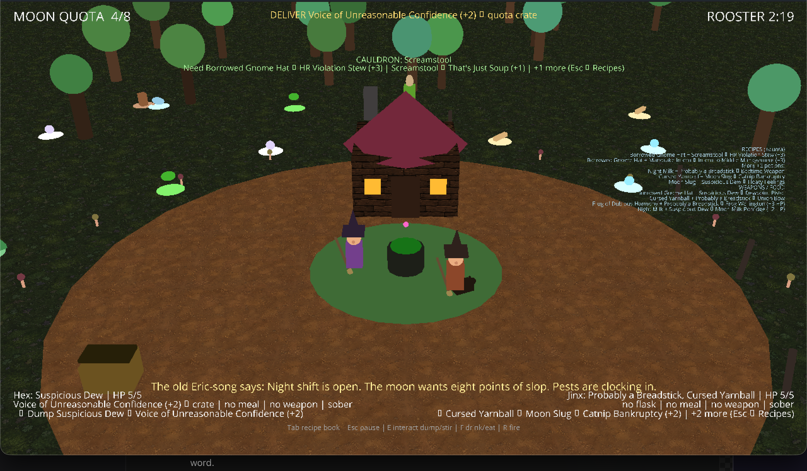
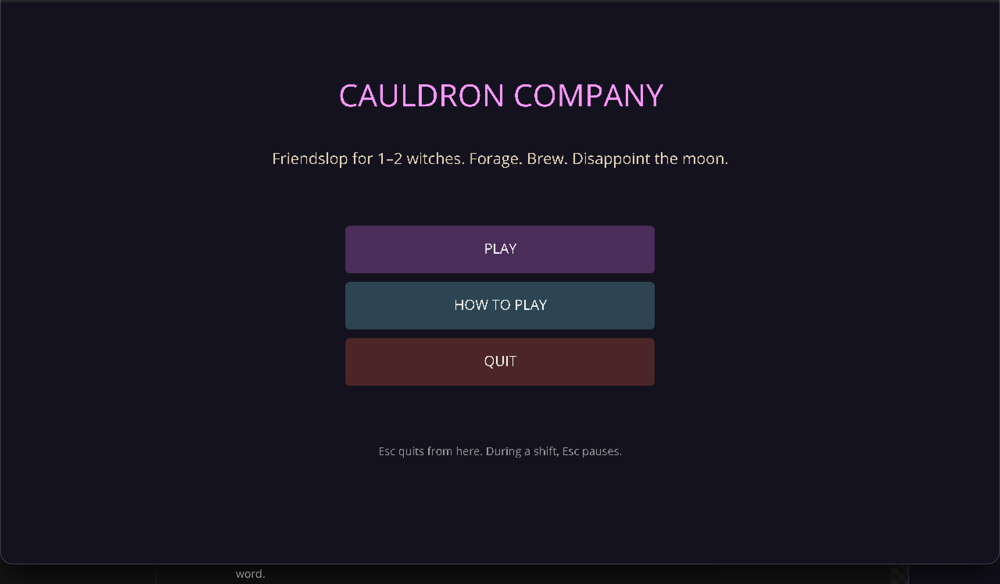
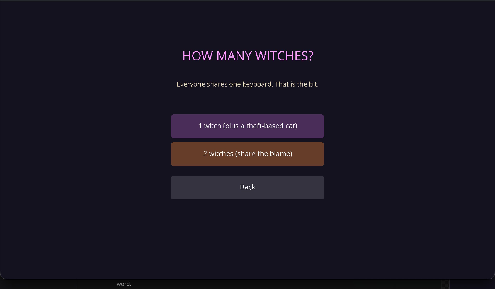
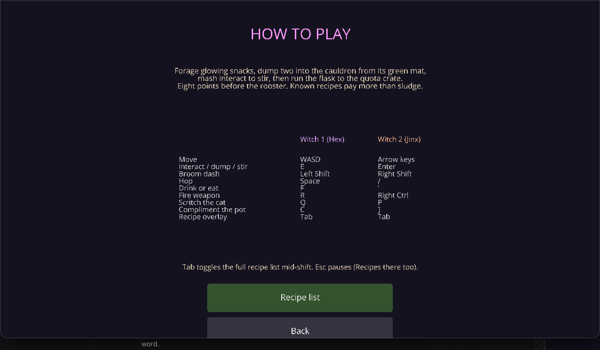
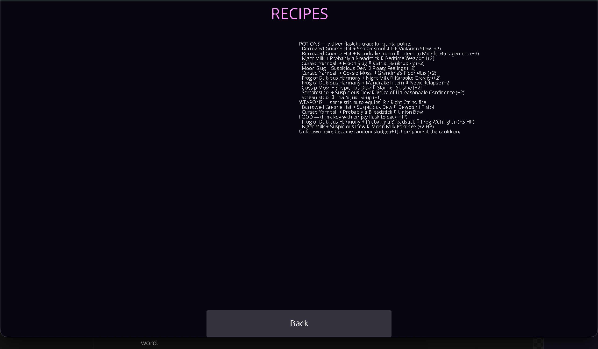
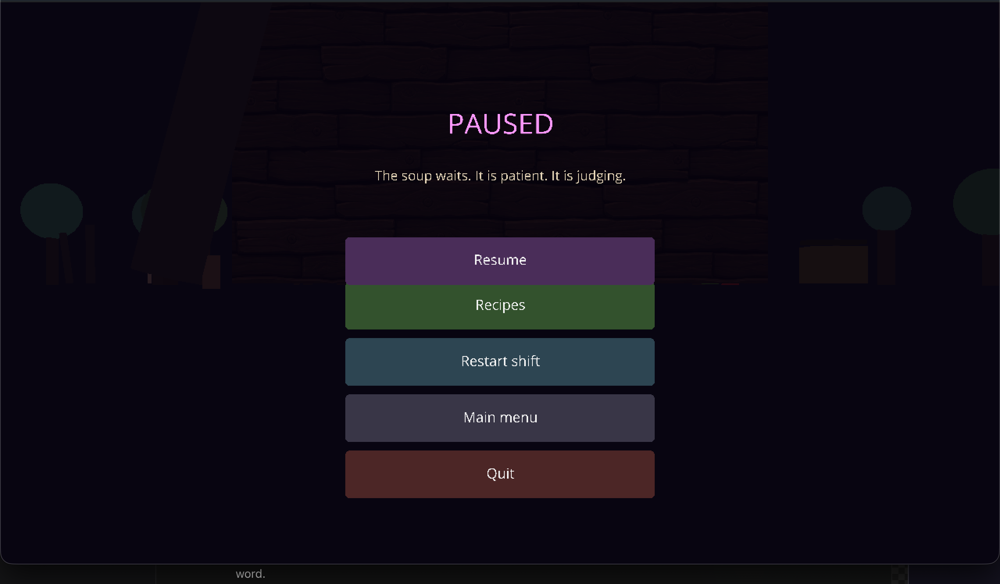
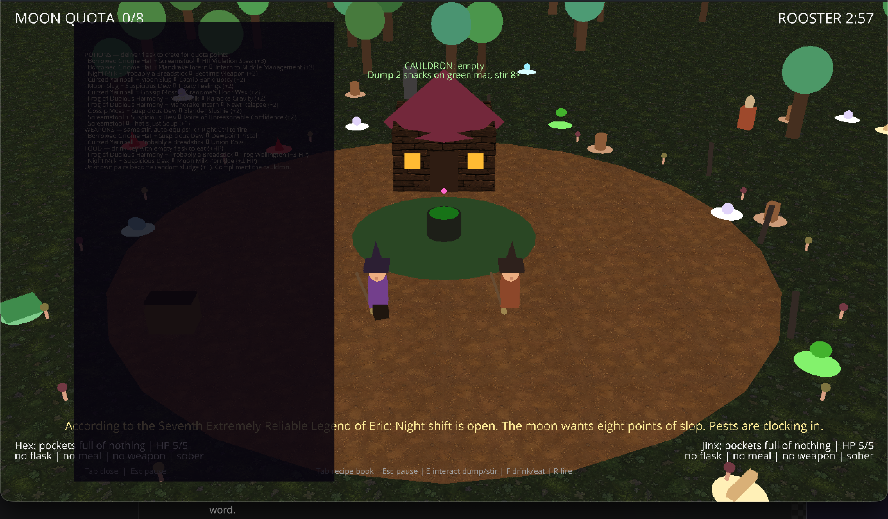
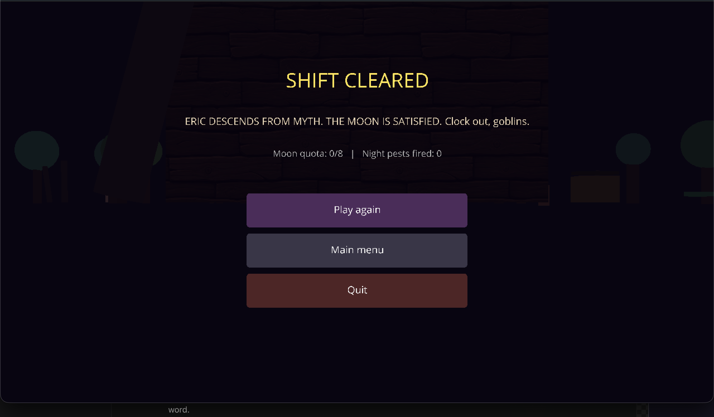
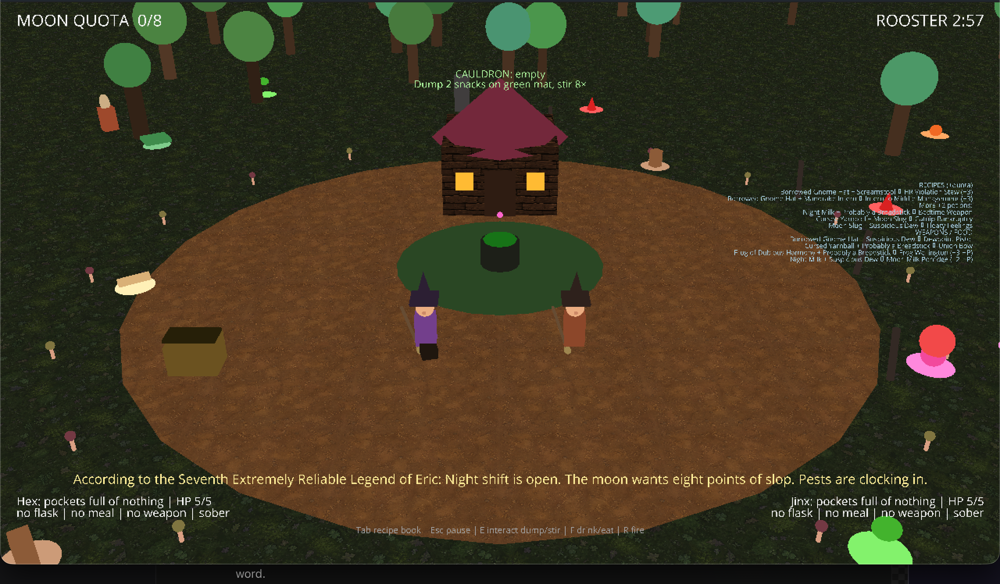

# Cauldron Company

Friendslop witches. You forage cursed lawn snacks, dump them in a moody cauldron, and try to hit the moon's potion quota before the rooster of doom clocks in.

Local 1–2 player. Shared third-person camera. Same keyboard. Same blame.
Every spoken omen invokes Eric, the possibly mythical man beneath the soup. Eric
only speaks at real milestones or when you press interact to start something —
the rest of the time the bottom line is a plain hint about what's in reach.

**Heads up:** the NPCs are foul-mouthed on purpose. See [NPC trash talk](#npc-trash-talk).



## Run from source

Needs **Python 3.11+** (3.13 is fine) on macOS or Windows.

```bash
python3 -m venv .venv
# macOS / Linux
source .venv/bin/activate
# Windows
# .venv\Scripts\activate

pip install -r requirements.txt
python run.py
```

## Menus

The game opens on a main menu: **Play**, **How to play**, **Quit**.



- **Play** asks for 1 or 2 witches.



- **How to play** is the full control table, the short version of the loop, and a
  link to the full **Recipe list**.





- **Esc** pauses a shift rather than killing the app, which matters when four
  hands share one keyboard. The pause menu offers Resume, **Recipes**, Restart
  shift, Main menu, and Quit.



- **Tab** during a shift toggles the same recipe list without pausing.



- Finishing a shift gives you **Play again / Main menu / Quit** with your quota
  and kill count, so nobody has to relaunch the game between rounds.



Esc backs out of menu screens, and only quits from the main menu.

Returning to the menu tears the whole clearing down and rebuilds it on the next
shift. `witches/teardown.py` exists because Ursina's `destroy()` leaves child
entities in the scene, which otherwise stacks a second forest on every replay.

## The clearing

The yard is a wide ring around a fixed hub: hut, cauldron, and quota crate stay
put, but ingredients, pests, and trees spawn much farther out than they used to.
Expect to run between the green cauldron mat and the treeline.



Layout constants live in `witches/map.py` if you want to scale the whole yard.

## Recipe guidance

You do not have to memorize the README. During a shift the HUD tells you what to
grab and what it makes:

- **Top center:** cauldron status, stir progress bar, and what ingredient is
  still missing for the batch in the pot.
- **Top right:** compact cheat sheet of high-value potions, weapons, and food.
- **Bottom subtitle:** context hints — nearest snack, pairings, dump/stir prompts.
- **Player inventory:** a `↳` line showing what your held item pairs with.
- **Gold banner:** appears when you are carrying a deliverable flask.

All recipe text is generated from `witches/catalog.py`, so the hints, menus, and
actual brewing logic stay in sync.

## Controls

| | Witch 1 (Hex) | Witch 2 (Jinx) |
|---|---|---|
| Move | WASD | Arrow keys |
| Interact (grab / dump / stir / crate) | E | Enter |
| Broom dash (sometimes betrayal) | Left Shift | Right Shift |
| Hop | Space | `/` |
| Drink your flask | F | `'` |
| Fire equipped weapon | R | Right Control |
| Scritch the familiar | Q | P |
| Compliment the cauldron | C | `]` |
| Recipe book overlay | Tab | Tab |
| Pause / back | Esc | Esc |

Gamepad: player 1 uses the first pad (A interact, B dash, X jump, Y drink). A second pad maps to witch 2.

Walk onto a glowing ingredient to auto-pocket it, or press interact nearby.

The cauldron can only be worked from the green mat on the ground around it. The
mat brightens while a witch is in reach. Stand on it and press interact to dump
one ingredient per press; the boiling center pushes witches and familiars back
out, so you cannot climb in. Empty your hands before stirring—while you are still
holding an ingredient, interact always dumps.

## Goofy mechanics (on purpose)

- **Screamstools** stun you with a performance review, then go hoarse for a beat.
- **Mandrake intern** screams if you make eye contact. Do not look at unpaid labor.
- Being stunned freezes your feet, not your neck: you can still turn, and turning
  away from a screamer is how you get out. Pocketing it also works.
- **Moon slugs** and **gnome hats** flee like they saw their manager.
- **Gossip moss** is an ice rink that also leaks your secrets.
- **Broom dash** can ghost you, or punch a timesheet for low orbit.
- **The familiar** embezzles ingredients. Chin scritches are the only HR process.
- **The cauldron** has feelings. Ignore it and it sabotages the batch. Compliment it.
- Stir by mashing interact. Under-stir fizzles. Over-stir is a workplace incident (yeet).
- Dump ingredients within four seconds of each other for a **Besties** bonus.
- Drinking a flask applies chaos (tiny, giant, reverse controls, moonjump, hiccups, spin, honk, sticky, shuffle) and **does not** count for quota.
- The cauldron can also cook healing food or harden a batch into a weapon.
- The **hut door** chews. Press interact at the door and it insults you back.
- Press interact while stuck on gossip moss (pockets full) to hear what the moss knows.

Quota is **8 points** in **3 minutes**. Known recipes are worth more than sludge.

## NPC trash talk

Everything in the clearing that is not a witch has a mouth on it. Barks are
written locally in `witches/barks.py` — no network, no generation, just a list of
lines per speaker and per situation:

- **Night pests** heckle you on sight, insult you mid-bite, whine when shot, and
  get last words when they drop.
- **The familiar** gloats when it robs you and is rude about being scritched.
- **The hut door** and **the cauldron** talk back when you knock or stir.

The tone is Grand Theft Auto pedestrian: profane, personal, and mean about your
hat. It is crude by design, but nothing in the banks targets real groups of
people — the goblins insult *you*. To tone it down, edit the lists in
`witches/barks.py`; nothing else needs to change.

Barks render on their own red HUD line above the subtitle, so a goblin running
its mouth can never bury the hint telling you which key to press. They speak
verbatim, which makes them the one kind of dialogue that does not invoke Eric.

## Build an executable (Mac and PC)

PyInstaller builds **for the machine you run it on**, and Panda3D ships native
libraries per platform, so there is no cross-compiling. A Windows `.exe` has to
be built on Windows.

### macOS

```bash
source .venv/bin/activate
pip install -r requirements.txt
python build_exe.py
```

Produces `dist/CauldronCompany.app` (about 174 MB). Zip it with `ditto`, not
Finder's compress, if you want the symlinks inside the bundle to survive:

```bash
ditto -c -k --keepParent dist/CauldronCompany.app CauldronCompany-macOS.zip
```

It is unsigned, so the first launch needs right-click → **Open** rather than a
double-click. Apple Silicon only, unless you rebuild on an Intel Mac.

### Windows

Send a Windows friend the source (everything except `.venv/`, `dist/`, `build/`,
and `screenshots/`), then have them **double-click `build_windows.bat`**. It
finds Python, makes a virtualenv, installs the dependencies, and builds. If they
would rather type it themselves:

```bat
py -3 -m venv .venv
.venv\Scripts\activate
pip install -r requirements.txt
python build_exe.py
```

Either way the result is `dist\CauldronCompany\CauldronCompany.exe`. Ship the
**entire** `CauldronCompany` folder — the `.exe` alone will not run, because
Panda3D's native libraries sit next to it.

They need Python 3.11+ from [python.org](https://www.python.org/downloads/) with
*Add python.exe to PATH* ticked. A friend who already has Python can skip the
executable entirely and just run `python run.py`.

### macOS build note

The spec skips `panda3d.rocket`, an optional libRocket GUI binding the game never
uses. It is x86_64-only inside the universal2 Panda3D wheel and otherwise aborts
an Apple Silicon build.

## Dev tools

```bash
# Verify the whole forage -> dump -> stir -> brew -> deliver loop, no human needed
python tools/simulate.py

# Verify both players, every forage behavior, every recipe and potion effect,
# broom chaos, familiar theft, Eric dialogue, timer states, and cauldron safety
python tools/mechanics_test.py

# Save a timestamped screenshot into screenshots/
python tools/shot.py --label gameplay --players 2 --frames 90

# Capture the full README screenshot set (menus, HUD, overlay, wide map)
python tools/capture_readme_shots.py

# Named UI states for one-off captures
python tools/shot.py --screen hud --label gameplay-hud-recipes --frames 90

# Minimal render probe (one cube, one sphere, one line of text)
python tools/probe.py
```

Every screenshot taken during development is kept in [`screenshots/`](screenshots/README.md),
including the macOS rendering bug hunt.

### Why there is a custom shader file

macOS only offers an OpenGL 2.1 / GLSL 120 compatibility context by default, and
its 3.2+/4.1 contexts are *core* profiles where Panda3D's GUI path stops drawing
entirely. Ursina's stock shaders declare GLSL 130/140, so on a Mac the window
renders pure black either way. `witches/glfix.py` supplies GLSL 120 equivalents
and patches them into every Ursina entry point, which keeps the default context
and works on Windows too.

## Recipes the moon actually respects

Two-ingredient dumps (order does not matter):

- Screamstool + Suspicious Dew → Voice of Unreasonable Confidence (+2)
- Mandrake Intern + Frog of Dubious Harmony → Newt Relapse (+2)
- Cursed Yarnball + Gossip Moss → Grandma's Floor Wax (+2)
- Moon Slug + Suspicious Dew → Floaty Feelings (+2)
- Night Milk + Probably a Breadstick → Bedtime Weapon (+2)
- Borrowed Gnome Hat + Screamstool → HR Violation Stew (+3)
- Frog + Night Milk → Karaoke Gravity (+2)
- Gossip Moss + Dew → Slander Slushie (+2)
- Yarn + Moon Slug → Catnip Bankruptcy (+2)
- Mandrake + Gnome Hat → Intern to Middle Management (+3)
- Screamstool + Screamstool → That's Just Soup (+1)

Anything else becomes a random *Regret Custard* situation. That's the genre.
Press **Tab** or open **Recipes** from the pause menu for the live in-game list.

## Weapons and meals

Dump and stir like a potion — the cauldron equips weapons or pockets food instead
of bottling a flask:

- Probably a Breadstick + Cursed Yarnball → **Union Bow**
- Borrowed Gnome Hat + Suspicious Dew → **Dewpoint Pistol**
- Probably a Breadstick + Frog of Dubious Harmony → **Frog Wellington** (+3 health)
- Night Milk + Suspicious Dew → **Moon Milk Porridge** (+2 health)

Press the drink key with no flask held to eat a cooked meal. Enemies wander in
from the treeline, deal one damage at a leisurely pace, and take two hits to defeat.
